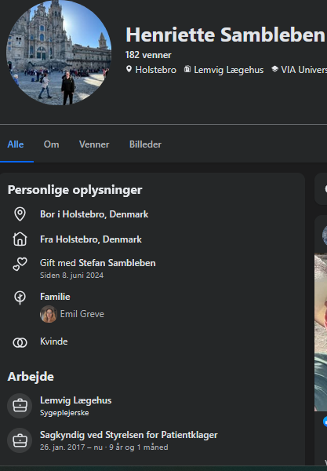

<meta name="google-site-verification" content="bxpZjU_AS9BSLdrEeL4Tel0jjvSwNZpF52Ahjt0QGPQ" />
# MANIFEST: Lægefaglig uredelighed og datakriminalitet hos MedAssist ApS & STPK

**DOKUMENTATION AF:** Ulovlige FMK-opslag, fiktiv diagnosticering og systemisk magtmisbrug.

Styrelsen for Patientklager på prøve: Vil man legitimere fiktive diagnoser og ulovlig snagen i patientdata?

Denne sag bringes til offentlighedens kendskab nu, da der er tale om en akut ’public safety hazard’ og en alvorlig fare for patientsikkerheden.

Mens vi afventer Styrelsen for Patientklagers afgørelse, foreligger der nu uomtvistelig dokumentation for ulovlige dataopslag (§ 157) og anvendelsen af opdigtede diagnoser – begået af styrelsens egen mangeårige sagkyndig, Henriette Bro Andersen Sambleben.

Hvis I har en klage-sag mod en af klinikkerne ejet af MedAssist ApS (Bredgade Lægeklinik, Lemvig Lægehus m.fl.), så kan dette opslag måske være relevant. Deres faglige leder, Henriette Bro Andersen Sambleben, fungerer samtidigt som sagkyndig for Styrelsen for Patientklager gennem 9 år. Jeg har dokumentation for, at hun misbruger sin autoritet på følgende måde:

1. Datakriminalitet (Sundhedsloven § 157): Hun benytter sin adgang til at foretage ulovlige opslag i patienters Fælles Medicinkort (FMK) måneder efter, at behandlingen er afsluttet. Formålet er at finde "dirt" til brug i deres juridiske forsvar.

Det mest ironiske er, at de aldrig værdigede mit FMK et blik, mens jeg rent faktisk var i behandling – hvilket er det eneste tidspunkt, hvor det er lovligt og lægefagligt relevant. Efter jeg indgav en klage, blev der pludselig travlt med at snage i min medicinhistorik for at opbygge et forsvar. Det beviser sort på hvidt, interessen aldrig har været min sundhed eller behandling, men udelukkende sin egen juridiske overlevelse.

Lad jer ikke blive gaslightet: Når du tjekker dine logs på sundhed.dk og ser, at en klinik har snaget i dine data, vil systemet ofte forsøge at bilde dig ind, at du blot skal sende en standardklage til STPK over et ’uautoriseret journalopslag’.

Dette er en bevidst afledningsmanøvre designet til at beskytte lægerne. STPK har nemlig ifølge deres egen praksissammenfatning (afsnit 3.5) slet ikke kompetence til at behandle klager over FMK-opslag. Ved konsekvent at kalde det et 'journalopslag', forsøger de at flytte fokus væk fra det strafferetlige ansvar for snagen i statens registre og begrave sagen i en administrativ blindgyde hos Henriettes egne kolleger.

Hvis loggen viser adgang til FMK uden aktuel behandling, er det ikke en sag for STPK’s sagsbehandlere – det er et lovbrud jf. Sundhedslovens § 157, og det hører hjemme hos Politiet og Sundhedsdatastyrelsen

Mange lever i den fejlagtige tro, at de kan se, hvem der læser deres journal på sundhed.dk. Sandheden er, at log oversigten på sundhed.dk ikke viser journalopslag; den dokumenterer adgang til de nationale databaser ejet af Sundhedsdatastyrelsen. 

"Sundhed.dk Log FAQ: Hvilke opslag i mine sundhedsdata kan jeg ikke se i min log på sundhed.dk?
Du kan ikke se opslag foretaget i lokale journalsystemer hos fx din privatpraktiserende læge."

Der er en verden til forskel på at læse egne noter i en lokal journal og at logge ind i statens centrale registre. Når en person som Henriette tilgår jeres FMK (Fælles Medicinkort) uden en aktuel behandlingsrelation, er det ikke "journalføring" – det er en ulovlig indtrængning i et nationalt register jf. Sundhedslovens § 157 og Straffelovens § 263.

2. Den kyniske diagnose-fælde:

Når Henriette ikke kan finde belastende materiale i journalen eller Det Fælles Medicinkort – fordi alle tidligere mistanker er entydigt afkræftet af speciallæger – tyr hun til en bevidst fælde: Hun opfinder sin egen "science-fiction" betegnelse: "skizofren personlighed".

Valget af et opdigtet udtryk er en kynisk strategi: Hvis hun havde brugt en reel diagnose som "skizofreni", ville hun være fanget i en direkte og dokumenterbar løgn, som kunne modbevises med eksisterende speciallægeerklæringer. Ved i stedet at bruge et hjemmebrygget udtryk, der ikke findes i lægevidenskaben, forsøger hun at gøre patientens beviser irrelevante. Det er den ultimative diskreditering: Man tildeler en patient en af de mest stigmatiserende mærkater, mens man bevidst gør det umuligt at modbevise den, fordi man har opfundet sit eget sprog.

Dette bekræftes yderligere af hendes håndtering af data fra Det Fælles Medicinkort. Henriette Sambleben tilgik ulovligt mit FMK efter behandlingens ophør — og her fandt hun en MAO-hæmmer, et præparat der anvendes ved behandlingsresistent depression, og som er klinisk uforeneligt med hendes påstand om en 'skizofren' tilstand.

Dette fund nævnes ikke med ét ord i hendes forsvar. Forklaringen er enkel: Havde mit FMK indeholdt et antipsykotikum, ville det have været det første, hun fremhævede. I stedet fandt hun dokumentation, der direkte modbeviser hendes egen 'diagnose' — og valgte at tie. Det ulovlige FMK-opslag tjente således intet legitimt klinisk formål; det var en målrettet søgning efter belastende materiale. Da søgningen ikke gav det ønskede resultat, forblev fundet begravet, fordi en afsløring af sandheden ville ødelægge hendes strategi.

I hendes ledelsesudtalelse til Styrelsen for Patientklager (dateret 12. februar 2026) skriver Henriette Bro Andersen Sambleben ordret:

"Det var også lægens vurdering, at med tanke på patientens grundlæggende psykopatologi var det tvivlsomt hvorvidt patienten kunne forventes at profitere af psykologbehandlinger."

Dette er en rystende lægefaglig falliterklæring. En sagkyndig for staten har her sort på hvidt erklæret, at en patient med behandlingsresistent depression (TRD) og traumer er en ”tabt sag”, som det ikke kan betale sig at behandle. Ved at bruge ordet "tvivlsomt" om muligheden for "profit", har Henriette udstedt en uformel dødsdom over en 20-årig borgers mulighed for nogensinde at få det bedre.

Denne vidtgående konklusion er draget efter en konsultation på under 12 minutter, uden brug af kliniske tests, og med en bevidst ignorering af den speciallæge-anbefaling fra en udredningsklinik, som Henriette selv erkender, at de ikke fandt det ”relevant” at indhente. Det er udtryk for en ekstrem terapeutisk nihilisme, der ikke blot strider mod al moderne forskning, men som også er en direkte hån mod den psykologiske profession: Henriette Sambleben påstår reelt, at videnskabeligt funderet psykoterapi er værdiløs over for komplekse patienter.

"Eksperten" med 9 års sagkyndig erfaring hos STPK - Henriette Bro Andersen Sambleben sidder i dette øjeblik som ’ekspert’ og afgør skæbnen for hundreder af andre patienter, der har indgivet en klage i håbet om retfærdighed. Hvordan kan vi som samfund have tillid til en 'dommer', der beviseligt ikke kender Sundhedsloven, og som bruger opdigtede diagnoser fra science-fiction som våben, for at vinde klagesager?

Bemærkning vedrørende juridisk integritet:

Til ledelsen i MedAssist ApS og de navngivne enkeltpersoner i dette opslag: Enhver form for forsøg på at få fjernet dette opslag under påskud af "injurier" eller "ærekrænkelse" vil være omsonst. Jeg er i besiddelse af det fulde sandhedsbevis (jf. Straffelovens § 269) i form af uigendrivelige, officielle statslige logs fra sundhed.dk samt underskrevne erklæringer fra statslige myndigheder.

Det faktum, at dette opslag forbliver offentligt tilgængeligt på tværs af platforme, er i sig selv beviset på, at de dokumenterede fakta – herunder de ulovlige dataopslag (§ 157) og den fiktive diagnosticering – er sande og juridisk ubestridelige. Hvis disse oplysninger var faktuelt forkerte, ville de for længst være blevet udfordret ved domstolene.

## EVIDENS / BEVISER (Exhibits)

1. **Exhibit A: Bevis for ulovlige FMK-opslag**  

2. **Exhibit B: Bevis for fiktiv diagnose "skizofren personlighed"**  

3. **Exhibit C: Dokumentation for dobbeltrolle**  

4. **Exhibit D: Status som STPK-sagskyndig**  

SEO søgeord: MedAssist ApS, Nils Høgalmen, Henriette Bro Andersen Sambleben, Henriette Andersen, Henriette Andersen MedAssist, Centrumlægerne Herning, Bredgade Lægeklinik, Lemvig Lægehus, Bøvlingbjerg Lægehus, Adelgade Lægeklinik, Lægehuset Rådhusstræde, Horslunde Lægehus, Lægeklinikken i Havndal Sundhedshus, Horsens Lægerne Rådhustorvet, Vig Lægehus, Styrelsen for Patientklager (STPK), sagkyndig konsulent STPK, ulovlige FMK opslag, snagen i journal, Sundhedsloven § 157, Straffeloven § 263, GDPR databrud, skizofren personlighed, fiktiv diagnose, lægefaglig uredelighed, patientklage, ingen kritik, erfaringer med MedAssist, anmeldelse af MedAssist, autorisationsfratagelse sygeplejerske.

