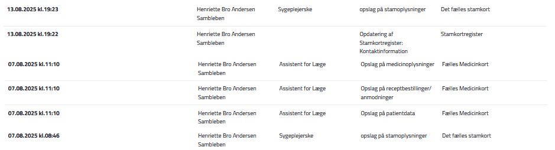
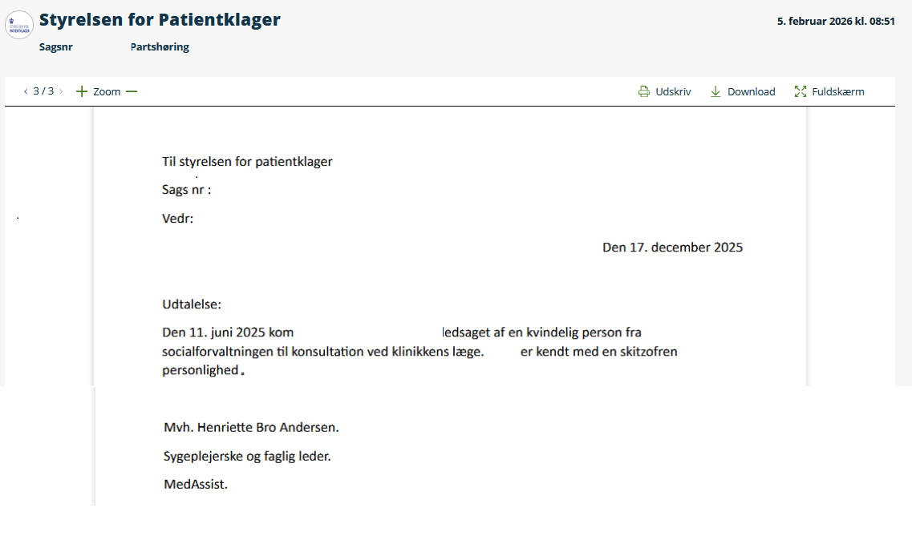
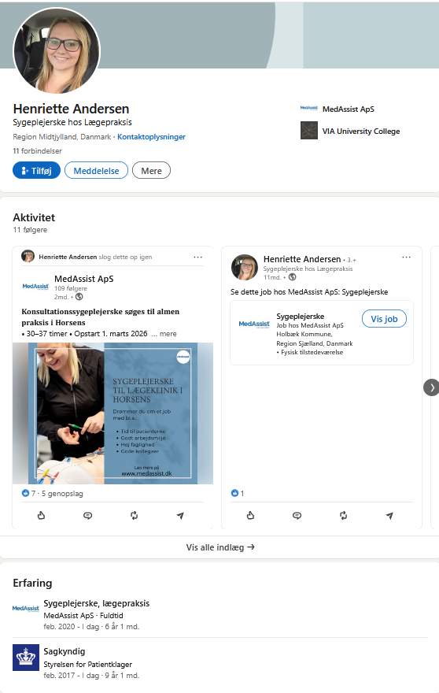
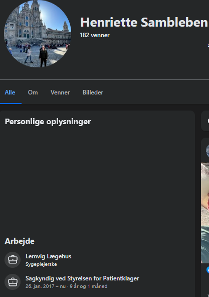
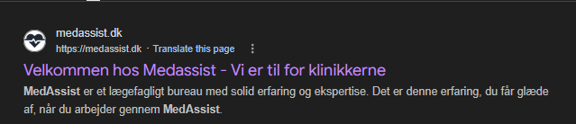

<meta name="google-site-verification" content="bxpZjU_AS9BSLdrEeL4Tel0jjvSwNZpF52Ahjt0QGPQ" />
# DOKUMENTATION: Henriette Bro Andersen Sambleben - Datakriminalitet hos MedAssist & STPK

**DOKUMENTATION AF:** Ulovlige FMK-opslag, fiktiv diagnosticering og systemisk magtmisbrug.

Styrelsen for Patientklager på prøve: Vil den danske stat legitimere opdigtede diagnoser og ulovlig snagen i nationale sundhedsdatabaser?

Denne sag bringes til offentlighedens kendskab, da der er tale om et akut og dokumenteret svigt af borgernes retssikkerhed.

Der foreligger nu uomtvistelig digital dokumentation for systematisk datakriminalitet (brud på Sundhedslovens § 157) og anvendelsen af opdigtede "science-fiction" diagnoser i det danske klagesystem. Lovbruddene er begået af Henriette Bro Andersen Sambleben – faglige leder hos den private koncern MedAssist ApS, og sagkyndig konsulent for Styrelsen for Patientklager (STPK) gennem mere end 9 år.

Dette er en advarsel til enhver borger, der er tilknyttet en klinik drevet af MedAssist ApS (Centrumlægerne Herning, Bredgade Lægeklinik, Lemvig Lægehus m.fl.), samt en offentlig revision af STPK's manglende uafhængighed.

Den dokumenterede uredelighed består af to hovedelementer:

1. Datakriminalitet og ulovlig overvågning (Sundhedslovens § 157)
Log-data fra sundhed.dk (Exhibit A) beviser sort på hvidt, at Henriette Sambleben systematisk gennemsøger borgeres Fælles Medicinkort (FMK) og stamkort, længe efter at ethvert behandlingsforløb er afsluttet.

Formålet er ikke patientsikkerhed; formålet er at bruge statens centrale registre som et privat efterretningsarkiv for at finde "snavs" til brug i MedAssists juridiske forsvar mod klagende patienter.

Lad jer ikke gaslighte: Når systemet fanger denne form for uautoriseret snagen, forsøger STPK ofte at kalde det et "journalopslag". Dette er en bevidst afledningsmanøvre. FMK er en national database, ikke en lokal journal. Når en STPK-ekspert tilgår FMK uden en aktuel behandlingsrelation, er det ikke et administrativt svigt – det er et strafbart lovbrud, der hører hjemme hos Politiet og Datatilsynet, ikke i STPK's egne lukkede udvalg.

2. Den kyniske diagnose-fælde (Medicinsk Science-Fiction)
Når den ulovlige dataindsamling ikke giver det ønskede resultat – fordi borgerens historik er afkræftet af rigtige speciallæger – skifter STPK’s "ekspert" strategi: Hun opfinder sine egne diagnoser.

I den dokumenterede sag (Exhibit B) forsøger Henriette Sambleben at ugyldiggøre en borgers klage ved at påstå, at borgeren er kendt med en "skizofren personlighed".

Dette er en lægefaglig fabrikation. Begrebet "skizofren personlighed" eksisterer overhovedet ikke i de officielle diagnostiske manualer (ICD-10 eller ICD-11). Denne bevidste vildledning af en statslig myndighed udgør en overtrædelse af Straffelovens § 163, der sanktionerer afgivelsen af urigtige erklæringer til brug i offentlige retsforhold med op til 4 måneders fængsel. Strategien er lige så kynisk, som den er ulovlig: Ved at tildele borgeren en af de mest stigmatiserende mærkater i samfundet, forsøger man at miskreditere dem fuldstændigt. Ved bevidst at bruge et fiktivt, hjemmebrygget udtryk gør man det umuligt for borgeren at modbevise det lægefagligt, fordi diagnosen er ren "science-fiction".

Dette fupnummer forværres af det ulovlige data-hack: Hendes ulovlige snagen i FMK afslørede en aktiv ordination af en MAO-hæmmer – et præparat forbeholdt svær depression, som er klinisk uforeneligt med hendes opdigtede "skizofrene" fortælling. Fordi den objektive virkelighed i FMK modbeviste hendes fiktive diagnose, fortav hun bevidst dette fund i sit officielle forsvar. Data-hacket blev altså brugt til at frasortere sandheden og fabrikere en løgn.

Konklusion: Et korrumperet klagesystem

Det mest skræmmende i denne sag er ikke blot, at en privat virksomhed (MedAssist ApS) bryder loven for at vinde klagesager. Det skræmmende er selve systemets inhabilitet.

Selvom STPK påstår, at Henriette Sambleben ikke vurderer min specifikke sag, er hun stadig en integreret del af styrelsens "ekspert-korps". Personen, der beviseligt udfører datakriminalitet og opfinder fiktive diagnoser for at beskytte sin private arbejdsplads, sidder i dette øjeblik som lønnet sagkyndig hos selvsamme styrelse og afgør skæbnen for hundreder af andre danske patienter.

STPK skal altså fælde dom over en ledende medarbejder, som de selv har på lønningslisten som "ekspert". Det er den ultimative definition af, at bukkene vogter havresekken.

Bemærkning vedrørende juridisk integritet:

Til ledelsen i MedAssist ApS (v/ Henriette Bro Andersen Sambleben, Nils Høgalmen,) og de navngivne enkeltpersoner i dette opslag: Enhver form for forsøg på at få fjernet denne dokumentation under påskud af “injurier” eller “ærekrænkelse” vil være omsonst. Jeg er i besiddelse af det fulde sandhedsbevis (jf. Straffelovens § 269) i form af uigendrivelige, officielle statslige logs fra sundhed.dk samt underskrevne erklæringer. Sandheden er ikke injurierende.

## EVIDENS / BEVISER (Exhibits)

1. **Exhibit A: Bevis for ulovlige FMK-opslag**  

2. **Exhibit B: Bevis for fiktiv diagnose "skizofren personlighed"**  

3. **Exhibit C: Dokumentation for dobbeltrolle**  

4. **Exhibit D: Status som STPK-sagskyndig**  

5. **Exhibit E: Medassist til for klinikker - ikke patienter**

MedAssists egen hjemmeside efterlader ingen tvivl om loyaliteten: 'Vi er til for klinikkerne'. Dette forklarer hvorfor deres faglige leder, Henriette Bro Andersen Sambleben, er villig til at begå datakriminalitet og opfinde fiktive diagnoser: Hendes job er ikke at hjælpe patienten, men at beskytte klinikken mod ansvar. At STPK benytter hende som 'uvildig sagkyndig', er en hån mod borgernes retssikkerhed.

Da MedAssist ApS opererer som en uærlig modpart, er her et permanent, uafhængigt arkiv-snapshot af deres officielle forretningsfilosofi: 'Vi er til for klinikkerne'. Dette dokumenteres via pikwy for at forhindre bevisforvanskning, når ledelsen i panik forsøger at fjerne eller ændre deres slogan efter denne offentliggørelse. Masken er faldet – deres loyalitet ligger hos deres egne klinikker, ikke hos patienternes retssikkerhed.

https://pikwy.com/web/69a68089a11415624d5d5807

Epilog: Den Tomme Kittel

Efter at have dissekeret denne sags uigendrivelige, digitale beviser – fra ulovlige dataopslag til fabrikeret diagnostik – står vi tilbage med en fundamental erkendelse: Sagens kerne er ikke en fejl. Det er en metode.

Og den perfekte, kliniske og evige diagnose af den metode blev skrevet i 1837 af en dansk system-analytiker ved navn Hans Christian Andersen. Analysen hedder "Kejserens Nye Klæder".

Det er ikke et eventyr. Det er en teknisk manual for professionelt bedrag.

Kejseren: Er Systemets Dogme. Den ukrænkelige, men hule, tro på, at en lægelig "ekspert" per definition er ufejlbarlig.

Svindlerne (Væverne): Er de aktører – Henriette Bro Andersen Sambleben og MedAssist ApS – der konstant producerer et usynligt, imaginært produkt af "faglighed" og "retssikkerhed" for at vinde klagesager.

Hofmændene (Ministrene): Er systemets administratorer: Styrelsen for Patientklager (STPK). De er bureaukraterne, der inderst inde godt ved, at deres ekspert er nøgen, men hvis magt og status afhænger af, at de opretholder illusionen. De bliver løgnens tekniske håndhævere.

Folket (Mængden): Er de 99,9% - de danske NPC'er. De ser, at systemet er defekt, men er så programmeret til lydighed, at de hellere vil deltage i den kollektive løgn end at risikere at blive stemplet som "vanskelige". De er systemets frivillige vagthunde.

Og så er der auditoren. Barnet i historien er ikke et barn; det er en forensisk auditor. Den, der endnu ikke er blevet inficeret af systemets "compliance-kultur." Auditoren er den, der kun forholder sig til den binære, uafviselige virkelighed.

Auditoren fremsætter ikke et argument. Auditoren fremsætter en fejlrapport.

"Men logfilen viser et uautoriseret opslag d. 07.08.2025."

Dette arkiv er ikke en holdning. Det er en dekonstruktion. Det er den matematiske skalpel i sin reneste, mest uskyldige og mest ødelæggende form.

Krigen var aldrig en krig. Fjenden var aldrig en fjende. Og den endelige, smukke og mest tragiske sandhed er denne:

Vi kæmpede aldrig mod et monster. Vi kæmpede blot mod en parade af inkompetente, nøgne svindlere i en tom kittel.

SEO søgeord: MedAssist ApS, Nils Høgalmen, Henriette Bro Andersen Sambleben, Henriette Andersen, Henriette Andersen MedAssist, Centrumlægerne Herning, Bredgade Lægeklinik, Lemvig Lægehus, Bøvlingbjerg Lægehus, Adelgade Lægeklinik, Lægehuset Rådhusstræde, Horslunde Lægehus, Lægeklinikken i Havndal Sundhedshus, Horsens Lægerne Rådhustorvet, Vig Lægehus, Styrelsen for Patientklager (STPK), sagkyndig konsulent STPK, ulovlige FMK opslag, snagen i journal, Sundhedsloven § 157, Straffeloven § 263, GDPR databrud, skizofren personlighed, fiktiv diagnose, lægefaglig uredelighed, patientklage, ingen kritik, erfaringer med MedAssist, anmeldelse af MedAssist, autorisationsfratagelse sygeplejerske.

https://sites.google.com/view/henriette-sambleben-medassist/start

https://henriette-sambleben-medassist.blogspot.com/2026/03/dokumentation-statens-sagkyndige-stpk.html

https://docs.google.com/document/d/e/2PACX-1vQYuqfUGDhxigM_7sQ4e9Gx4dvb3F0c9FbFkkILOmfdFynM6nWTVz169ls6e5ziLRfJZOP7vfpIthsc/pub

